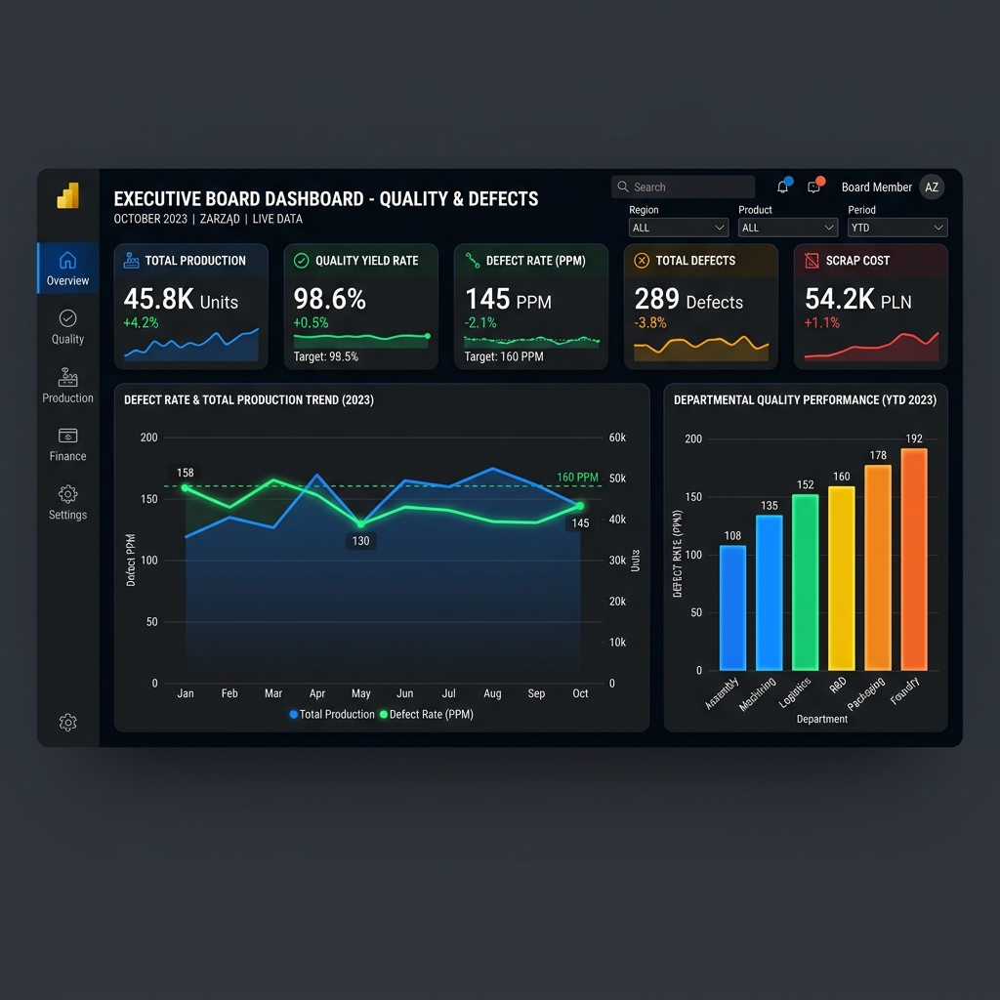
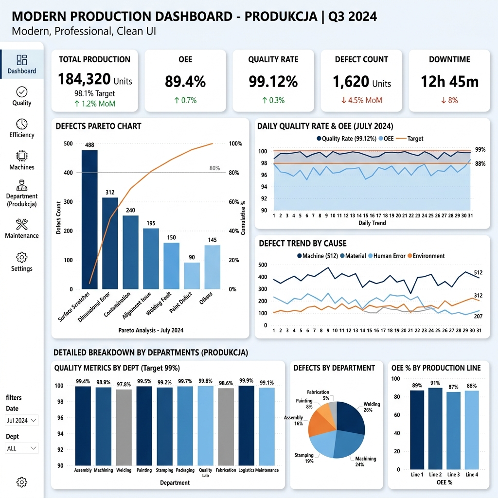
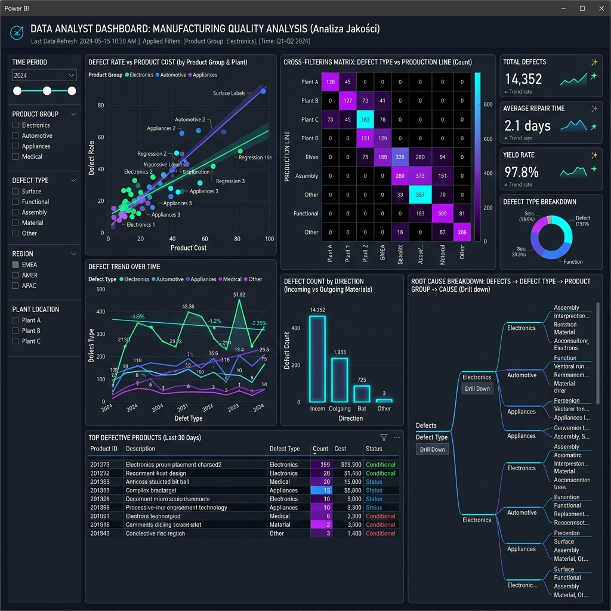

# Dokumentacja i Projekt Dashboardów Power BI - Raport Wad

Na podstawie analizy pliku `Skumulowany_Raport_Wad_PowerBI.xlsx` przygotowałem strukturę trzech dedykowanych dashboardów dla różnych grup odbiorców. 

## 1. Dashboard dla Zarządu (Executive Overview)
**Cel:** Szybki ogląd sytuacji, identyfikacja kluczowych trendów jakościowych i najgorzej performujących obszarów. Minimalna interakcja, maksymalna czytelność.



**Elementy wizualne:**
- **Karty KPI (Top):**
  - Całkowita liczba wad w bieżącym miesiącu.
  - Odchylenie (zmiana % miesiąc do miesiąca).
  - Najgorzej performujący Wydział i Kierunek.
- **Wykres Liniowy:** Trend całkowitej liczby wad w ujęciu miesięcznym (`Zrodlo_Miesiac`).
- **Wykres Słupkowy Skumulowany:** Porównanie liczby wad pomiędzy wydziałami (`Wydział`) z podziałem na kierunek sprzedaży (`Kierunek`).
- **Top 5 Wad:** Prosta tabela lub wykres słupkowy poziomy z 5 najczęściej występującymi problemami (`Wada`).

---

## 2. Dashboard dla Produkcji (Production Quality Control)
**Cel:** Identyfikacja wąskich gardeł, problematycznych procesów na hali produkcyjnej i priorytetyzacja działań korygujących.



**Elementy wizualne:**
- **Slicery (Filtry):** Filtr na `Zrodlo_Miesiac` (domyślnie obecny miesiąc), `Wydział`.
- **Wykres Pareto (Linia + Kolumna):** Rozkład typów wad (`Wada`) dla wybranego wydziału z linią skumulowanego udziału procentowego. Pomaga to w identyfikacji 20% wad generujących 80% problemów.
- **Wykres Kołowy/Donut:** Procentowy udział głównych grup produktów (`Grupa ogólna`) w ogólnej liczbie wad.
- **Tabela Szczegółowa:** Lista wszystkich wad, z podziałem na `Wydział`, `Grupa ogólna` i wartościami bezwzględnymi (`Ilość`), sformatowana za pomocą mapy cieplnej (heat map) dla kolumny "Ilość".

---

## 3. Dashboard dla Analityków (Cross-Analysis & Deep Dive)
**Cel:** Samodzielna eksploracja danych, poszukiwanie korelacji, dogłębna analiza odstępstw od normy.



**Elementy wizualne:**
- **Rozbudowany Panel Slicerów:** Miesiąc, Wydział, Kierunek, Grupa ogólna.
- **Macierz (Matrix Visual):** Wielowymiarowa tabela rozbijająca dane w wierszach (np. `Wydział` -> `Grupa ogólna` -> `Wada`) a w kolumnach z miesiącami (`Zrodlo_Miesiac`), pokazująca `Ilość` oraz zmianę do poprzedniego miesiąca.
- **Wykres Drzewa (Treemap):** Hierarchiczna struktura wad i grup dla błyskawicznego wizualnego wykrycia, która kategoria objętościowo stanowi największy problem.
- **Key Influencers (AI Visual):** Wizualizacja Power BI "Kluczowe czynniki wpływające", która po nakarmieniu danymi odpowie na pytanie np. "Co wpływa na to, że Ilość wad jest wysoka?".

---

## Brakujące Miary i Propozycje DAX

Dane wejściowe zawierają jedynie wymiary i surową `Ilość`. Do pełnego wykorzystania potencjału Power BI potrzebujemy dodatkowych miar (Measures), które musisz zaimplementować:

1. **Total Defects:** 
   Suma wszystkich wad w danym kontekście.
   ```dax
   Total Defects = SUM('Tabela'[Ilość])
   ```

2. **Previous Month Defects (MoM):**
   Aby to działało idealnie, polecam stworzyć lub przypiąć tabelę kalendarza (`DateTable`) do kolumny `Zrodlo_Miesiac` (wymaga rzutowania `03_2026` na format daty, np. `01.03.2026`).
   ```dax
   Total Defects PM = CALCULATE([Total Defects], PREVIOUSMONTH('DateTable'[Date]))
   ```

3. **% Change MoM:**
   ```dax
   % Change MoM = DIVIDE([Total Defects] - [Total Defects PM], [Total Defects PM], 0)
   ```

4. **Defect Share %:**
   Udział danej wady w całkowitej puli (przydatne do wykresów i tabel).
   ```dax
   Defect % = DIVIDE([Total Defects], CALCULATE([Total Defects], ALLSELECTED('Tabela')))
   ```

5. **Pareto Cumulative %:**
   Niezbędne do wykresu Pareto dla produkcji.
   ```dax
   Pareto % = 
   VAR CurrentDefects = [Total Defects]
   VAR TotalAllDefects = CALCULATE([Total Defects], ALLSELECTED('Tabela'[Wada]))
   VAR RunningTotal = CALCULATE(
       [Total Defects],
       FILTER(ALLSELECTED('Tabela'[Wada]), [Total Defects] >= CurrentDefects)
   )
   RETURN DIVIDE(RunningTotal, TotalAllDefects)
   ```

---

## Gotowy Prompt do generowania modelu / implementacji w Power BI

Poniższy prompt możesz skopiować i wkleić do ChatGPT / Claude / PowerBI Copilot, aby uzyskać dokładny kod M (Power Query) oraz wszystkie miary dostosowane do modelu.

***

**Prompt do skopiowania:**

```text
Jesteś ekspertem Power BI i DAX. Posiadam płaską tabelę danych o nazwie 'RaportWad' z następującymi kolumnami:
- 'Wydział' (tekst)
- 'Kierunek' (tekst, np. PL, EX)
- 'Grupa ogólna' (tekst)
- 'Wada' (tekst)
- 'Ilość' (liczba całkowita)
- 'Zrodlo_Miesiac' (tekst w formacie MM_RRRR np. "03_2026")

Twoje zadanie:
1. Napisz dla mnie kod w M (Power Query), który przekształci kolumnę 'Zrodlo_Miesiac' na poprawny typ daty (pierwszy dzień danego miesiąca) oraz wygeneruje powiązaną tabelę wymiaru kalendarza (DateTable) dającą się połączyć z główną tabelą.
2. Napisz dokładne miary DAX dla następujących wskaźników:
   - Całkowita liczba wad (Total Defects)
   - Liczba wad z poprzedniego miesiąca (Previous Month Defects) - z uwzględnieniem połączonej tabeli dat.
   - Procentowa zmiana miesiąc do miesiąca (% Change MoM) odporna na błędy dzielenia przez zero.
   - Skumulowany procent dla wykresu Pareto (Pareto Cumulative %) według kolumny 'Wada'.
   - Ranking (Rank) wydziałów według największej liczby wad.
3. Przedstaw optymalny model danych (jak połączyć tabele, czy wydzielać tabele słownikowe wymiarów dla 'Wydział' czy 'Grupa ogólna').
Zależy mi na bardzo wysokiej wydajności modelu zgodnej z zasadami Star Schema.
```
