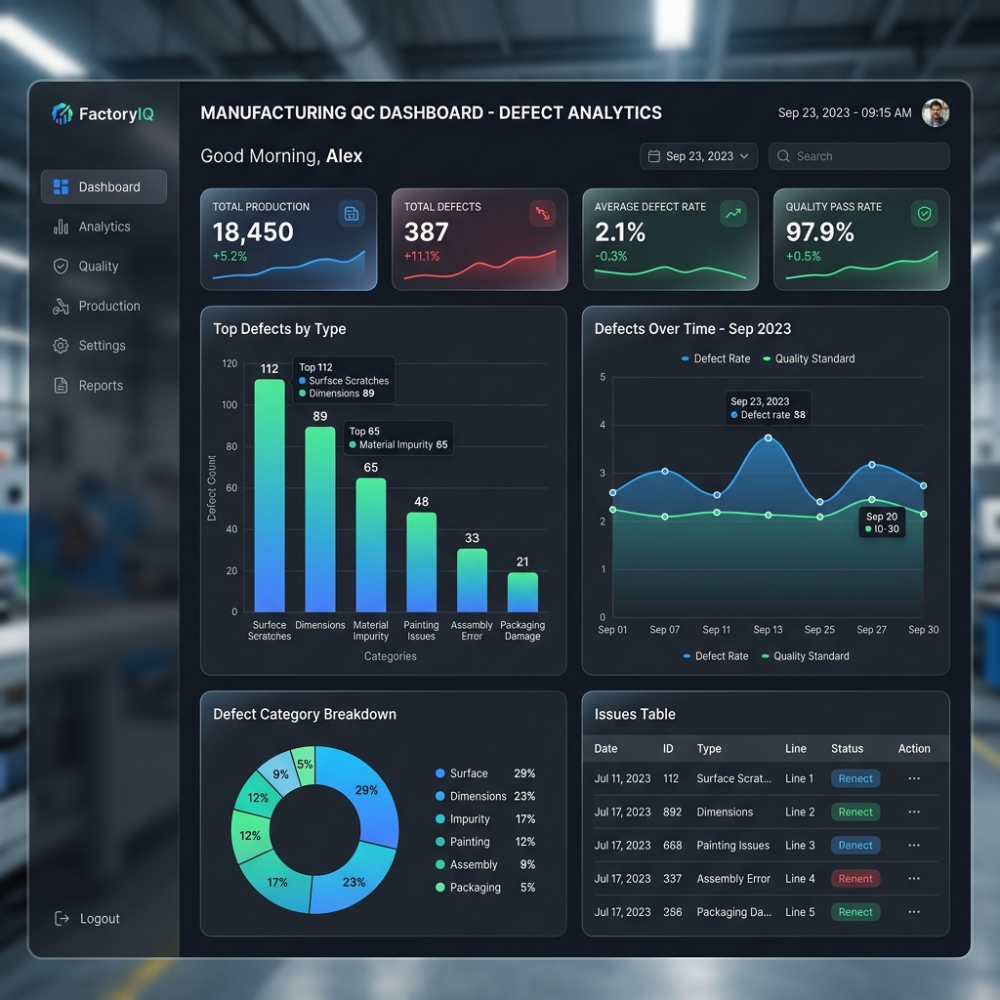
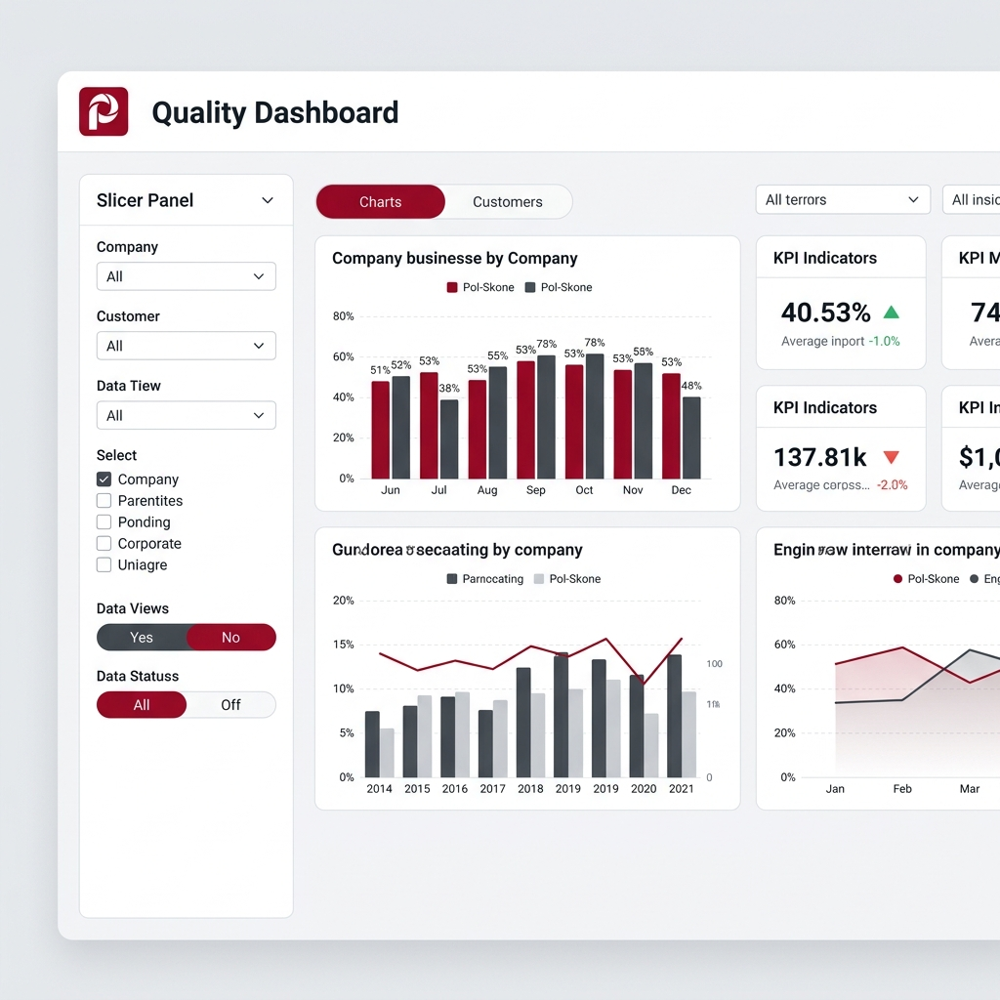
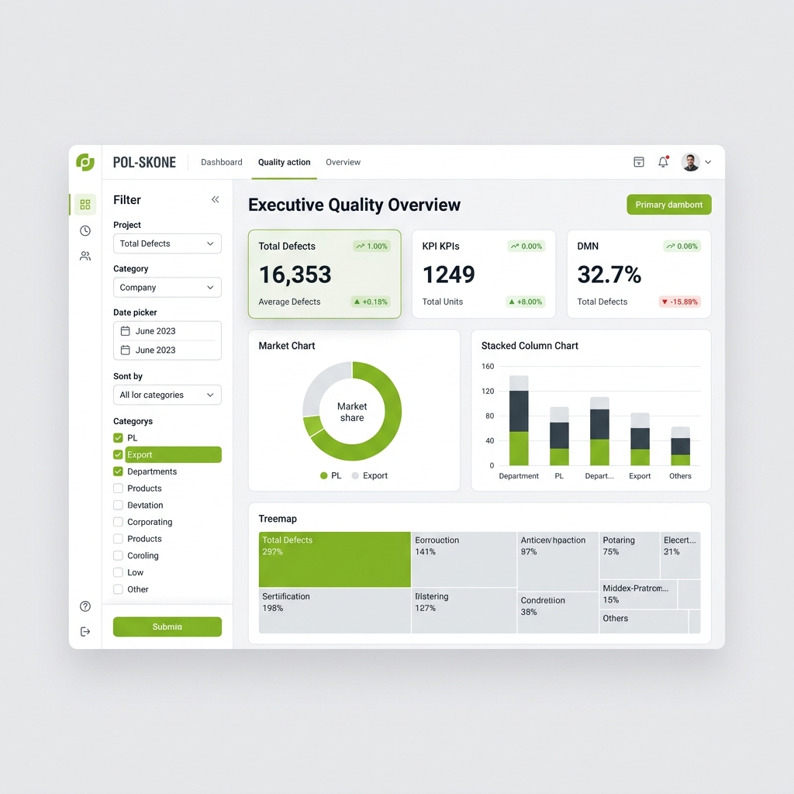
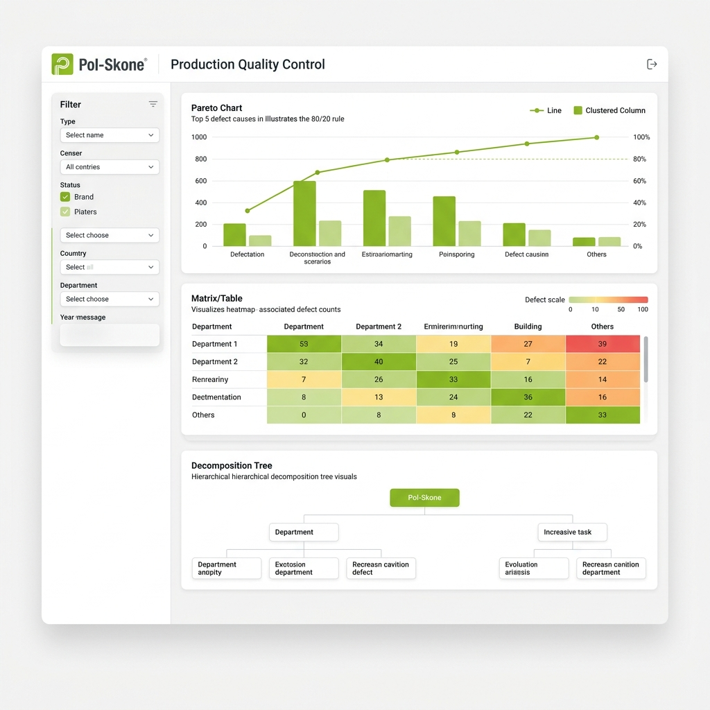
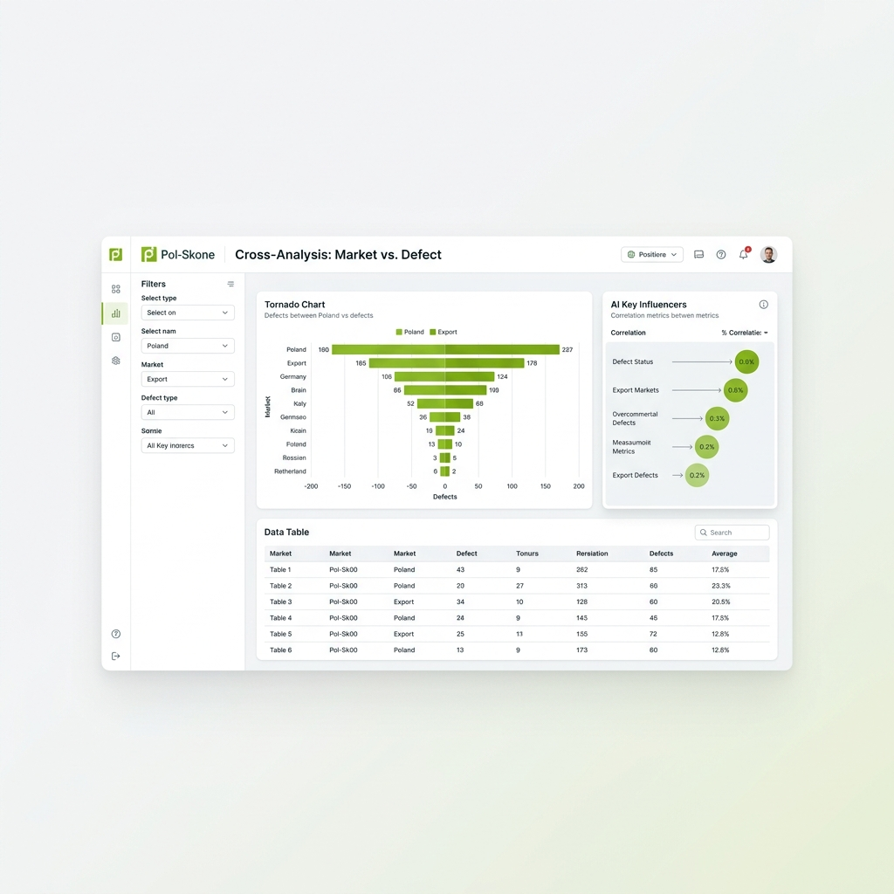
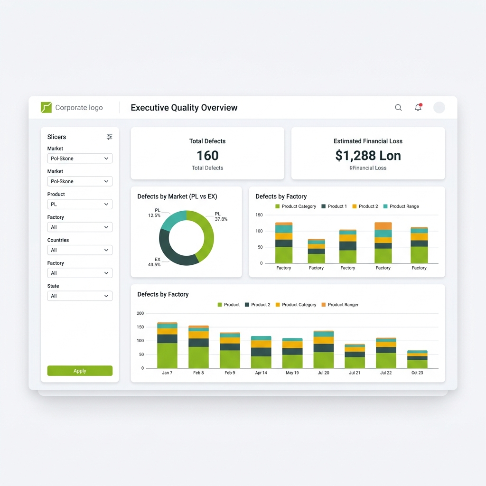

# Poglądowe Wizualizacje Dashboardów Power BI

Poniżej znajdują się wygenerowane koncepcje 3 dashboardów opisanych w specyfikacji. Zadbałem o to, aby obrazy ukazywały pełny ekran i nie były ucięte.

## 1. Executive Quality Overview (Dla Zarządu)

## 2. Production Quality Control (Dla Kierownika Produkcji)

## 3. Cross-Analysis: Market vs. Defect (Analityczny)

## 4. Koncepcja UI: Dark Mode & Glassmorphism (Pol-Skone)

## 5. Koncepcja UI: Corporate Jasny (Pol-Skone) z Panelem Filtrów

## 6. Nowy - Executive Quality Overview

## 7. Nowy - Production Quality Control

## 8. Nowy - Cross-Analysis: Market vs. Defect

